## Credit Card Fraud Detection

**Author**
Polsani, Prashanth Kumar (https://github.com/polsanip)

### Executive Summary

For the credit card transaction prediction use case, I utilized a simulation dataset sourced from Kaggle, with fraud transactions accounting for 0.5% of the dataset.

Following the CRISP-DM methodology, I meticulously cleaned the data and performed feature engineering to prepare for model training. Further details on data processing and feature engineering can be found in the respective sections.

The models experimented with include:

* LogisticRegression
* KNN
* DecisionTreeClassifier
* SVM
* GaussianNB
* SGDClassifier

After training these models, I evaluated their performance using metrics such as f1_score and balanced score from the sklearn metrics library, focusing particularly on true positives.

Unfortunately, all models showed poor performance in predicting true positives. However, KNN and DecisionTreeClassifier demonstrated relatively better performance in this regard. For detailed outcomes, please refer to the results section.

Moving forward, as outlined in the next steps of this README, it is crucial to further explore and evaluate advanced models to identify and select the most suitable model for this specific use case.

### Purpose
Detecting fraud in credit card transactions aims to minimize financial losses for a financial institution and foster trust with its customers.

### Research Inquiry
Determining whether a specific credit card transaction constitutes fraud.

### Dataset Details
The dataset, accessible at https://www.kaggle.com/datasets/kartik2112/fraud-detection, consists of simulated credit card transactions encompassing both legitimate and fraudulent activities occurring between 1st January 2019 and 31st December 2020. It includes transactions made by 1000 customers across a diverse set of 800 merchants. The data was generated using the simulation tool found at https://github.com/namebrandon/Sparkov_Data_Generation.

### Approach
The classification of transactions as fraudulent or legitimate in machine learning was conducted using the following tools and techniques.

#### Data Analysis
Exploring a dataset with over 1 million rows and more than 20 features involved detailed analysis using various visualization tools such as *matplotlib*, *seaborn*, and *plotly* to understand each feature's characteristics and their interrelationships.

Below are key findings from the analysis:

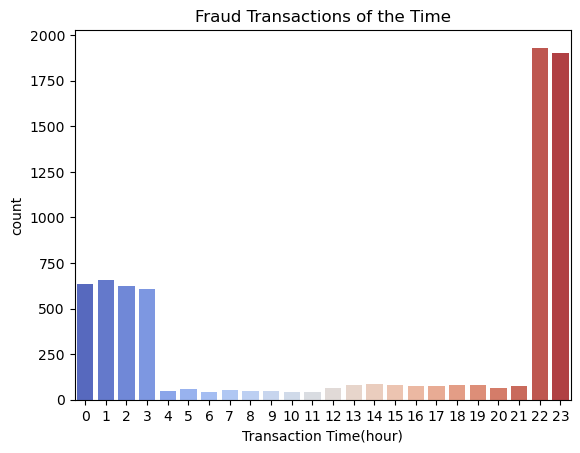

This plot indicates that fraudulent transactions are more prevalent during nighttime hours.

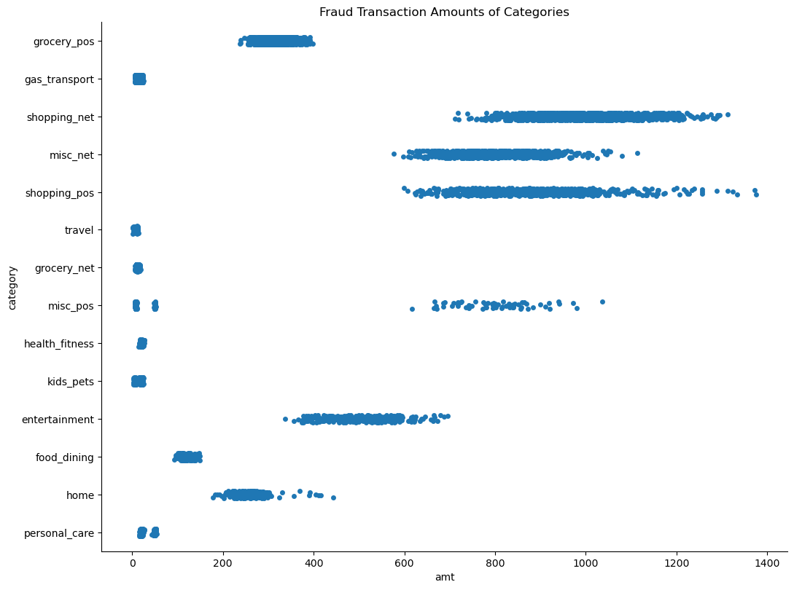

The distribution plot highlights a higher incidence of fraud in internet transactions.

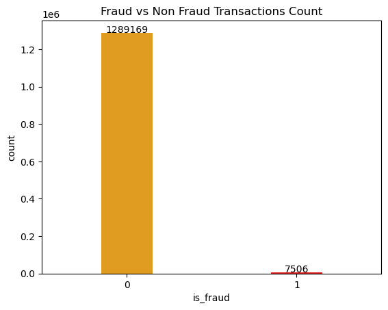

This plot reveals that out of nearly 1.3 million records, only 7506 transactions are classified as fraudulent.

#### Data Preprocessing
* Removed unnecessary columns such as transaction numbers, merchant names, customer names, etc., as they do not contribute to model evaluation.

#### Feature Engineering
* Introduced additional features such as transaction hour derived from transaction datetime, and age calculated from date of birth.
* Utilized *JamesSteinEncoder* for encoding categorical data.
* Applied *StandardScaler* to standardize the dependent features.
* Split the data into training and testing sets, with a test split size of 30%.

Below are visualizations related to feature engineering:

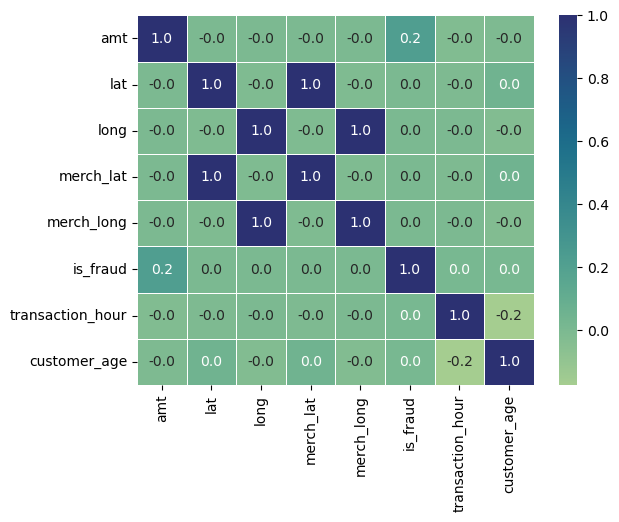
The heatmap displays correlations, both positive and negative, among various features. Notably, latitude and longitude with merchant coordinates show a strong positive correlation. Amount correlates positively with fraud, while transaction time and age exhibit negative correlations.

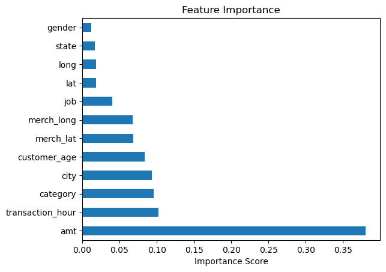
This plot highlights important features crucial for predicting fraud in transactions. Key features such as amount, transaction time, and city are identified as highly influential.

#### Model Evaluation
Conducted evaluation on the following models:
* Logistic Regression
* K-Nearest Neighbors (KNN)
* Decision Tree Classifier
* Support Vector Machine (SVM)
* Gaussian Naive Bayes (GaussianNB)
* Stochastic Gradient Descent Classifier (SGDClassifier)

### Results
Following training using **GridSearchCV** with 5-fold cross-validation, the models yielded the following outcomes:

None of these models accurately predicted *true positive* classes.

Below are confusion matrix plots for the evaluated models:

  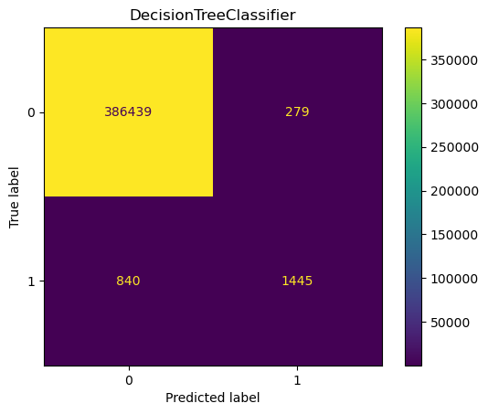 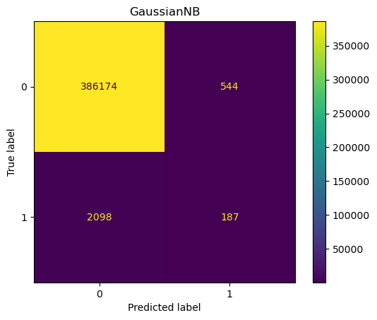 

These plots indicate very low *true positive* predictions across the models.

Additionally, the following plot displays the f1_score and balanced score of these models:

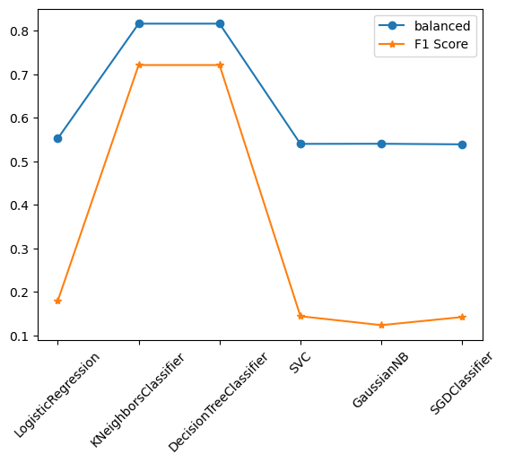

### Advanced Approaches

Following the evaluation of the aforementioned models and in accordance with the suggested next steps documented [here](https://github.com/trguduru/credit_card_fraud_detection_initial#next-steps), the models were trained and evaluated as described below.

#### Addressing Class Imbalance

The target class (is_fraud) is highly imbalanced, with fraud transactions constituting only 0.5% of the entire dataset of 1.2 million records.

To balance this dataset, consider employing the following techniques:
* Random Over Sampling
* BorderlineSMOTE
* SMOTE
* ADASYN

Below are some confusion matrices of these models:
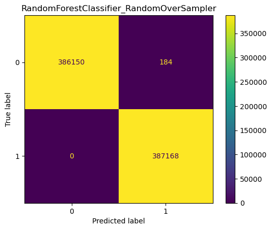
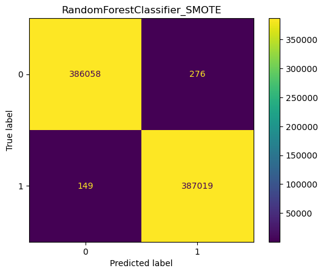 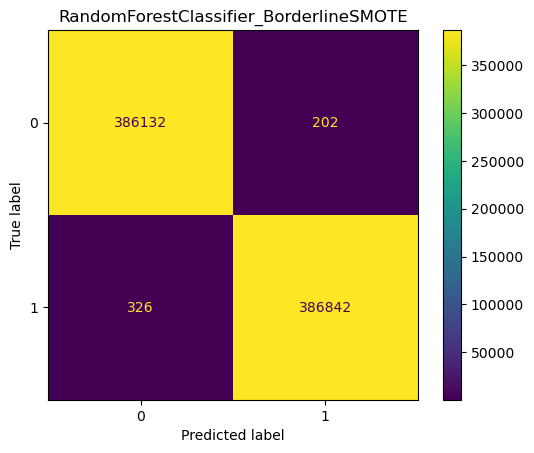

While these oversampling techniques effectively predict *true positives*, they may exhibit overfitting due to duplicated data. This could potentially impact performance on unseen data.

#### Ensemble Models
To potentially enhance model accuracy, consider utilizing ensemble techniques and models such as:

* BaggingClassifier
* AdaBoostClassifier
* BalancedRandomForestClassifier
* RUSBoostingClassifier
* RandomForestClassifier

Evaluation of these models revealed their performance in predicting *true positives*. Below are some confusion matrices illustrating their effectiveness:

 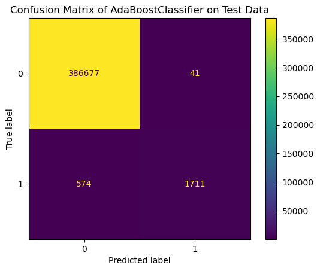 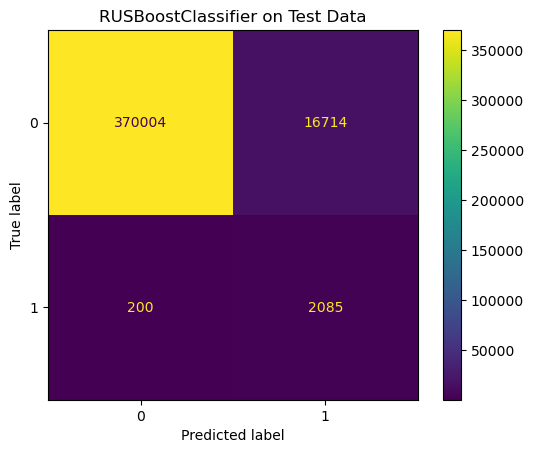 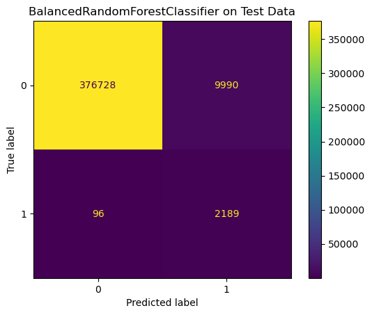

Among these models, the **BalancedRandomForestClassifier** stands out, achieving more than 95% accuracy in predicting *true positive* instances.

#### Neural Networks
Implementing deep neural network models like *Dense* networks alongside cross-validation could potentially enhance accuracy.

Evaluation of deep learning models, with and without hyperparameter tuning, yielded the following results and plots:

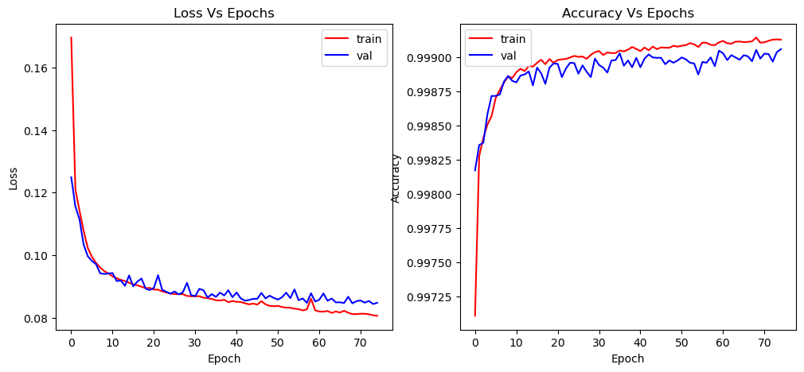

This plot illustrates the performance of a basic deep learning model across epochs, showing improvements in terms of loss and accuracy. However, it still struggles with accurately predicting *true positives*.

Here is the architecture of the basic deep learning model:
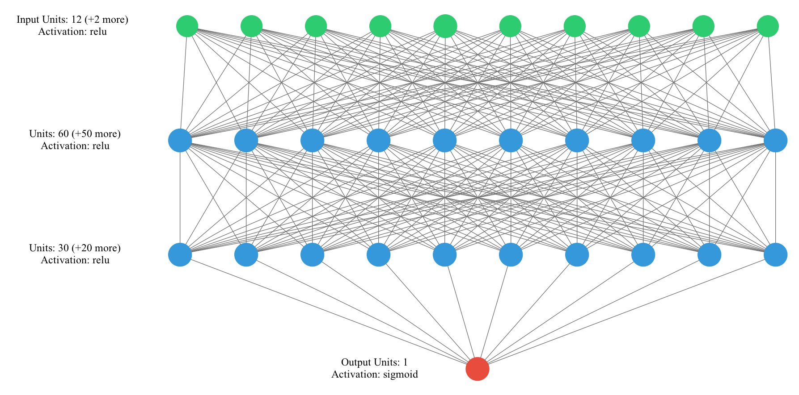

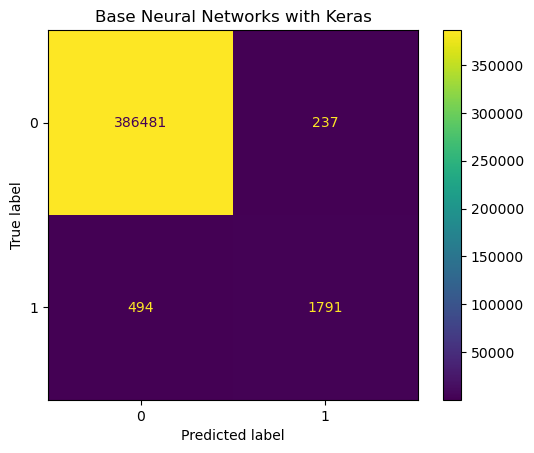

The basic deep learning model with 2 hidden layers achieved a *true positive* prediction rate of approximately 70%.

##### Hyperparameter Tuning

The deep learning model was fine-tuned using **RandomizedSearchCV**, resulting in the following optimized neural network architecture diagram:

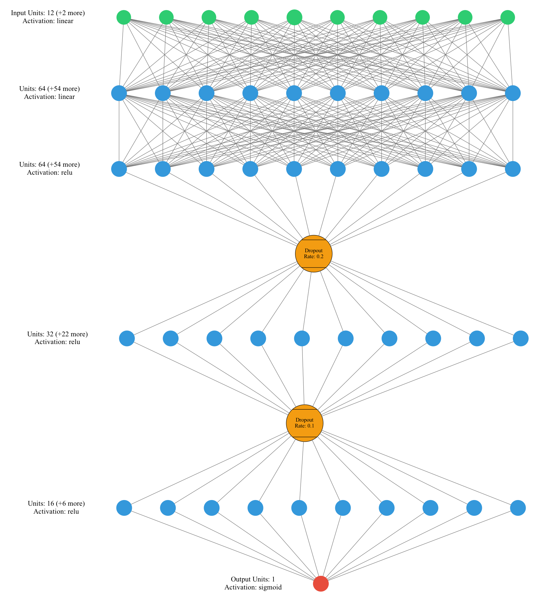

This optimized model includes additional regularization layers (Dropouts with rates of 0.2 and 0.1) and incorporates more hidden layers.

However, the resulting confusion matrix indicates that the hyperparameter-tuned model, despite enhancements, did not improve upon the prediction accuracy achieved by the basic deep learning model:

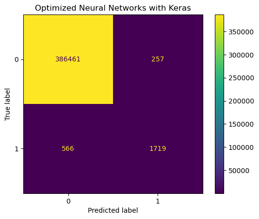

The tuned model's prediction accuracy remains comparable to or lower than that of the basic deep learning model.

### Final Results

The following plot summarizes the performance of all models trained on this dataset:

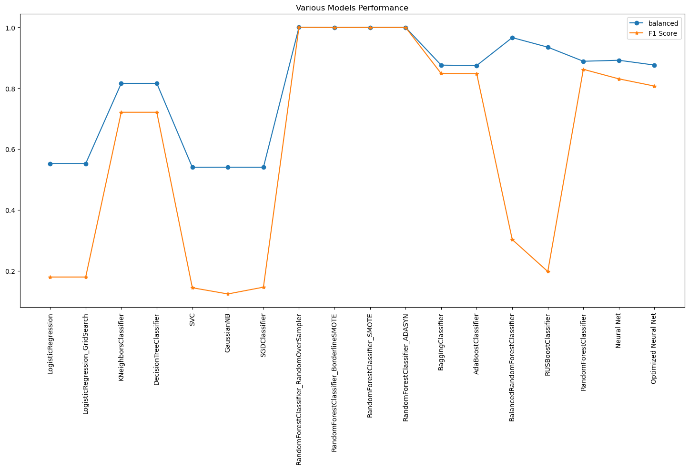

The plot indicates that ensemble models and oversampling techniques perform better compared to other models evaluated.

The primary objective of this project is to accurately predict fraudulent transactions, which is crucial for minimizing financial losses for financial institutions.

#### Best Model
Upon evaluating all models, the **BalancedRandomForestClassifier** stands out as the top performer.

Here are the results obtained from testing this model on a dataset it has never encountered before:

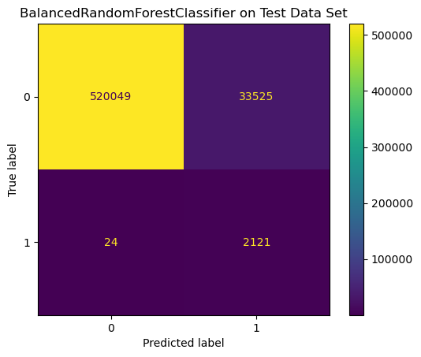

The confusion matrix above demonstrates that the BalancedRandomForestClassifier achieves over 95% accuracy in predicting fraudulent transactions.

### Outline of project

#### Project Structure
The project is organized into several folders containing various files:

* **data**: Contains train and test datasets.
* **images**: Includes various images of data analysis and model performance plots.
* **jupyter notebook**: Contains notebooks used for data exploration, model training, and evaluation.
* **README**: Provides project information and instructions.
* **git helper files**: Includes files related to version control management.

#### Deliverables
- [Jupyter Notebook](credit_card_fraud_detection.ipynb)

#### Library Requirements
To run this project you need to install the following libraries
* default anaconda environment
* category_encoders
* keras_visualizer
* imblearn
* sklearn_evaluation